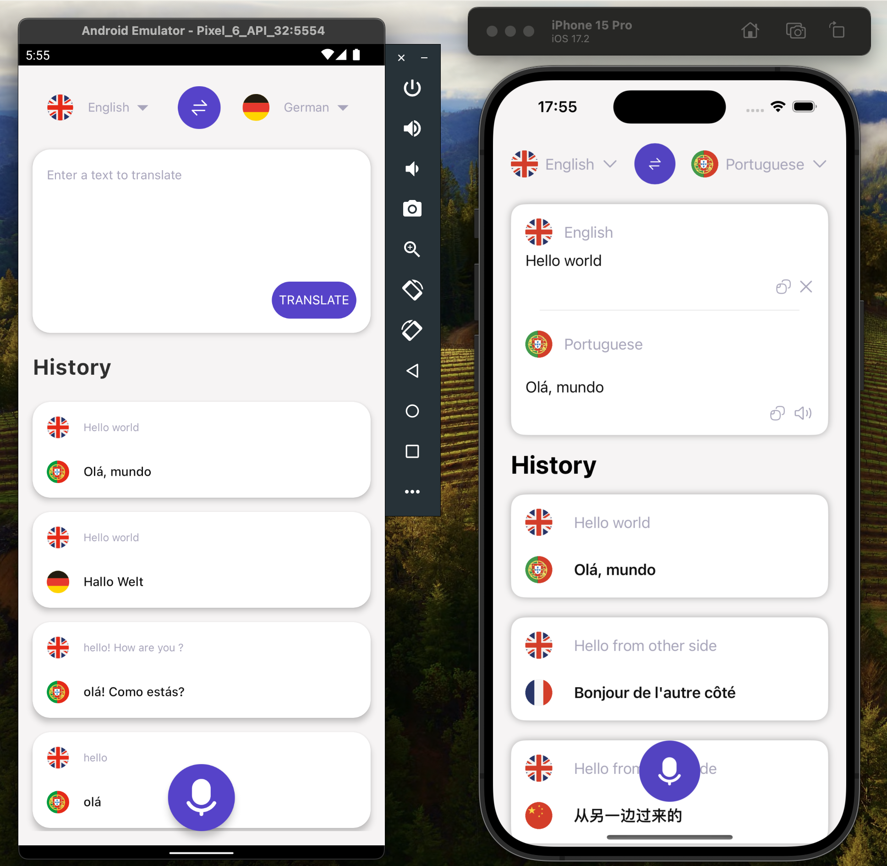

# Translator App
Translator App is a Kotlin Multiplatform/Kotlin Mobile Multiplatform project that helps users to translate sentences from one language to another.
This app was built during Building Industry-Level Multiplatform Apps with KMM course.

## Screenshot

## Features
- Translate sentences from one language to another
- Save translations to history
- View translations history
- Voice input for translations
- Translation speech output

## Platforms
 | 
:----: | :----:
✅ | ✅

## Architecture
The app is shared between Android and iOS. The shared code is written in Kotlin and the UI is built natively with Jetpack Compose for Android and SwiftUI for iOS. Shared code, written in Kotlin.

### Modules

- **shared**:
    - contains all the shared code between the platforms
- **androidApp**:
    - contains the android app with the UI built with Jetpack Compose
- **iosApp**:
    - contains the iOS app with the UI built with SwiftUI

## Run project
### Android
To run the application on android device/emulator:
- open project in Android Studio and run imported android run configuration

### iOS
To run the application on iPhone device/simulator:
- Open `iosApp/iosApp.xcworkspace` in Xcode and run standard configuration
- Or use [Kotlin Multiplatform Mobile plugin](https://plugins.jetbrains.com/plugin/14936-kotlin-multiplatform-mobile) for Android Studio
